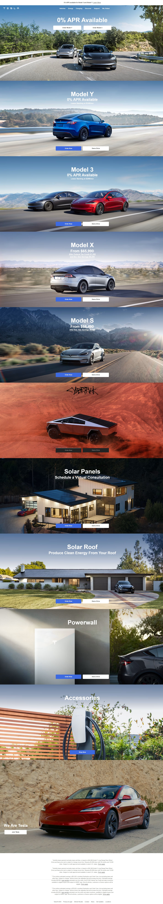

# Tesla Landing Page Clone

A simplified clone of the Tesla landing page, built with HTML and CSS to practice modern web design techniques.

## Screenshot

## Description
This project is a front-end representation of the Tesla landing page, showcasing the use of HTML and CSS for layout and styling. It features a responsive design that adapts to different screen sizes.

## Installation
To run this project locally:
1. Clone the repository:
    `git clone https://github.com/ke1ran/Tesla-Clone-24.git`
2. Navigate to the project folder:
    `cd Tesla-Clone-24`
3. Open index.html in your browser.

## Contributions
Contributions are always welcome! If you have any improvements or additions, feel free to submit a pull request. 

## License
This project is open-source and available under the MIT License.(https://opensource.org/licenses/MIT)

